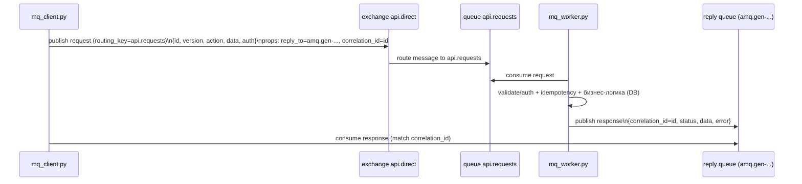

# Лабораторная работа №4 «Проектирование и реализация API на основе очередей сообщений (RabbitMQ)»

 
**Цель:** Изучить подход к проектированию API, работающего через асинхронный обмен сообщениями. Научиться использовать RabbitMQ как шину взаимодействия между клиентами и сервером, реализуя основные принципы надёжности и масштабируемости API.
**Основа:** бизнес-логика, сущности и версии API сохранены как в Lab1 (Task Manager API), отличается только способ взаимодействия: **RabbitMQ вместо HTTP**.

---

## 1. Кратко о том, что сделано

В Lab1 взаимодействие было по HTTP (FastAPI).  
В Lab4 взаимодействие заменено на обмен сообщениями через RabbitMQ:

- **Клиент (lab4/mq_client.py)** публикует запросы в RabbitMQ.
- **Воркер/сервер (lab4/mq_worker.py)** читает запросы из очереди, выполняет ту же бизнес-логику (БД, пользователи, задачи) и отправляет ответ обратно.
- Реализованы:
  - **Аутентификация** (JWT, как в Lab1)
  - **Идемпотентность** по `request.id` (таблица `processed_requests`)
  - **Retry** при временных ошибках
  - **DLQ** для необрабатываемых сообщений
  - **Логи ошибок** и действий воркера

---

## 2. Архитектура и схема обмена сообщениями

### 2.1. Роли

- **RabbitMQ** — брокер сообщений (шина взаимодействия).
- **mq_client.py** — тестовый RPC-клиент (демо отправки запросов).
- **mq_worker.py** — воркер, который заменяет HTTP-сервер: обрабатывает сообщения и работает с БД через код Lab1.

### 2.2. Схема (RPC over AMQP)



Ключевые поля:
- `id` запроса = `correlation_id` (по нему клиент сопоставляет ответ с запросом)
- `reply_to` — очередь, куда воркер отправляет ответ конкретному клиенту

---

## 3. Очереди, exchange и маршруты

Используется `exchange` типа **direct**: `api.direct`.

Очереди:

1) `api.requests` — основная очередь запросов  
   - routing key: `api.requests`

2) `api.requests.retry` — очередь повторной обработки (retry)  
   - сообщения попадают сюда при временной ошибке  
   - TTL задержка → потом сообщение возвращается в `api.requests` (через DLX)

3) `api.requests.dlq` — **Dead Letter Queue (DLQ)**  
   - сюда попадают сообщения, которые не удалось обработать после N попыток
   - сообщения сохраняются для анализа

> В UI RabbitMQ “Get messages” — действие потенциально разрушительное. Для безопасного просмотра можно использовать режим `Nack requeue true`.

---

## 4. Формат сообщений

### 4.1. Запрос

```json
{
  "id": "uuid-or-custom-id",
  "version": "v1",
  "action": "health_check",
  "data": { },
  "auth": ""
}

Поля:

id — уникальный идентификатор запроса (используется для идемпотентности)

version — версия API (v1, v2)

action — операция (например register, login, create_task)

data — данные запроса

auth — токен/ключ (в работе используется JWT)

4.2. Ответ
{
  "correlation_id": "uuid",
  "status": "ok",
  "data": { ... },
  "error": null
}


Поля:

correlation_id — равен id запроса

status — ok или error

data — результат

error — текст ошибки при status=error