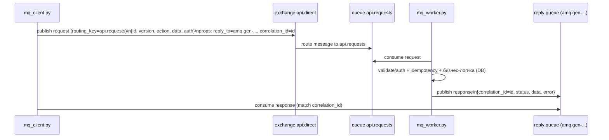

# Лабораторная работа №4 «Проектирование и реализация API на основе очередей сообщений (RabbitMQ)»

 
**Цель:** Изучить подход к проектированию API, работающего через асинхронный обмен сообщениями. Научиться использовать RabbitMQ как шину взаимодействия между клиентами и сервером, реализуя основные принципы надёжности и масштабируемости API.
**Основа:** бизнес-логика, сущности и версии API сохранены как в Lab1 (Task Manager API), отличается только способ взаимодействия: **RabbitMQ вместо HTTP**.

---

## 1. Кратко о том, что сделано

В Lab1 взаимодействие было по HTTP (FastAPI).  
В Lab4 взаимодействие заменено на обмен сообщениями через RabbitMQ:

- **Клиент (lab4/mq_client.py)** публикует запросы в RabbitMQ.
- **Воркер/сервер (lab4/mq_worker.py)** читает запросы из очереди, выполняет ту же бизнес-логику (БД, пользователи, задачи) и отправляет ответ обратно.
- Реализованы:
  - **Аутентификация** (JWT, как в Lab1)
  - **Идемпотентность** по `request.id` (таблица `processed_requests`)
  - **Retry** при временных ошибках
  - **DLQ** для необрабатываемых сообщений
  - **Логи ошибок** и действий воркера

---

## 2. Архитектура и схема обмена сообщениями

### 2.1. Роли

- **RabbitMQ** — брокер сообщений (шина взаимодействия).
- **mq_client.py** — тестовый RPC-клиент (демо отправки запросов).
- **mq_worker.py** — воркер, который заменяет HTTP-сервер: обрабатывает сообщения и работает с БД через код Lab1.

### 2.2. Схема (RPC over AMQP)



Ключевые поля:
- `id` запроса = `correlation_id` (по нему клиент сопоставляет ответ с запросом)
- `reply_to` — очередь, куда воркер отправляет ответ конкретному клиенту

---

## 3. Очереди, exchange и маршруты

Используется `exchange` типа **direct**: `api.direct`.

Очереди:

1) `api.requests` — основная очередь запросов  
   - routing key: `api.requests`

2) `api.requests.retry` — очередь повторной обработки (retry)  
   - сообщения попадают сюда при временной ошибке  
   - TTL задержка → потом сообщение возвращается в `api.requests` (через DLX)

3) `api.requests.dlq` — **Dead Letter Queue (DLQ)**  
   - сюда попадают сообщения, которые не удалось обработать после N попыток
   - сообщения сохраняются для анализа

> В UI RabbitMQ “Get messages” — действие потенциально разрушительное. Для безопасного просмотра можно использовать режим `Nack requeue true`.

---

## 4. Формат сообщений

### 4.1. Запрос

```json
{
  "id": "uuid-or-custom-id",
  "version": "v1",
  "action": "health_check",
  "data": { },
  "auth": ""
}
```

**Поля:**

- `id` — уникальный идентификатор запроса (используется для **correlation** и **идемпотентности**).
- `version` — версия API (`v1`, `v2`).
- `action` — операция (например `register`, `login`, `create_task`).
- `data` — данные запроса.
- `auth` — токен/ключ (в работе используется **JWT**).

### 4.2. Ответ

Формат ответа (JSON):

```json
{
  "correlation_id": "uuid",
  "status": "ok",
  "data": { },
  "error": null
}
```

**Поля:**

- `correlation_id` — равен `id` запроса (по нему клиент сопоставляет ответ с запросом).
- `status` — `ok` или `error`.
- `data` — результат.
- `error` — текст ошибки при `status=error`.

---

## 5. Версионность и операции (как в Lab1)

Смысл и структура операций сохранены (как в Lab1). Отличие только в транспорте: **HTTP → RabbitMQ**.

**Примеры действий:**

### v1

- `health_check`
- `register`
- `login`
- `create_task`
- `list_tasks`
- `update_task` (v1-логика, если используется)
- `delete_task` (если есть)

### v2

- `update_task` (расширенная модель, например `priority`)
- другие расширенные операции (если реализованы)

---

## 6. Аутентификация (безопасность)

В проекте используется **JWT**, как и в Lab1:

- `register` и `login` выполняются **без токена**.
- операции с задачами требуют `auth = JWT` (допускается формат `Bearer <token>`).

**Почему JWT подходит:**

- stateless: серверу не нужна сессия.
- удобно передавать в сообщениях как строку.
- хорошо подходит для распределённой обработки (несколько воркеров).

---

## 7. Идемпотентность

### 7.1. Зачем нужна идемпотентность в очередях

RabbitMQ (и вообще MQ) часто работает по принципу **at-least-once**: сообщение может быть доставлено повторно  
(например, при падении воркера до подтверждения `ack`).

Без идемпотентности повторный `create_task` создал бы **дубликат**.

### 7.2. Как реализовано

Используется таблица БД `processed_requests`:

- если запрос с `id` уже обработан → воркер возвращает сохраненный `response_json`;
- если нет → выполняет действие и сохраняет результат.

**В таблице сохраняется:**

- `id` запроса
- `created_at`
- `response_json`

**Это обеспечивает:**

- отсутствие дублей при повторной доставке
- возможность “повторить ответ” на тот же `id`

---

## 8. Обработка ошибок и надежность (retry + DLQ)

### 8.1. Retry

Если при обработке запроса произошла ошибка, воркер:

- увеличивает счетчик попыток (`x-retry-count`);
- публикует сообщение в `api.requests.retry`;
- `api.requests.retry` настроена с TTL задержкой;
- после TTL сообщение возвращается в `api.requests`.

### 8.2. DLQ

После достижения максимального числа попыток (например 3):

- сообщение отправляется в `api.requests.dlq`;
- в DLQ сохраняется payload с:
  - временем (`failed_at`)
  - причиной (`reason`)
  - исходным запросом (`request`)
  - служебными headers RabbitMQ (`x-death`, `x-retry-count`)

**Пример (из UI RabbitMQ):**

- `x-retry-count: 3`
- `reason: retries exhausted: ...`
- `request: { id, version, action, data, auth }`

---

## 9. Логирование

Воркер пишет события:

- успешные обработки: `ok: <id> v1.action`
- повторы: `retry #N for <id> because ...`
- окончательный перенос в DLQ: `dead-lettered: <id> err=...`
- идемпотентный replay: `idem-replay: <id> v1.action`

---

## 10. Запуск (Windows, без Docker)

### 10.1. Зависимости Python

```bash
pip install -r requirements.txt
```

### 10.2. RabbitMQ

RabbitMQ должен быть запущен локально.  
Management UI: `http://localhost:15672`

AMQP порт:

- обычно `5672`, но в данной настройке использован `5673` (как в окружении проекта).

Если у вас другой порт — поменять в `lab4/mq_common.py` (класс/настройки `MQSettings`).

### 10.3. Запуск воркера

В одном окне:

```bash
python -m lab4.mq_worker
```

### 10.4. Запуск клиента (демо)

Во втором окне:

```bash
python -m lab4.mq_client
```

---

## 11. Демонстрационные примеры запросов/ответов

### 11.1. Успешный прогон

- `health_check` → ok
- `register` → ok
- `login` → ok + `access_token`
- `create_task` → ok
- `list_tasks` → ok (список задач)
- `update_task v2` → ok (обновление `status`/`priority`)

**Пример ответа:**

```json
{"correlation_id":"...","status":"ok","data":{"status":"ok"},"error":null}
```

### 11.2. Демо идемпотентности

Клиент отправляет один и тот же `request_id` для `create_task` несколько раз.  
Результат:

- задача создается один раз;
- повтор возвращает тот же ответ (в логах воркера видно `idem-replay`).

### 11.3. Демо retry + DLQ

Используется тестовый флаг `simulate_temp_error=true` (для демонстрации временной ошибки).  
Результат:

- `retry #1`, `retry #2`, `retry #3`
- затем `dead-lettered` и сообщение появляется в `api.requests.dlq`

---

## 12. Работа с очередями в UI (что смотреть и зачем)

### Что смотреть

**Queues and Streams:**

- `api.requests` — входящие запросы
- `api.requests.retry` — сообщения на повторной обработке
- `api.requests.dlq` — ошибки и “мертвые” сообщения

В `api.requests.dlq` → **Get messages**:

- увидеть `reason`, `request`, `x-retry-count`, `x-death`

### Почему UI пишет “Get messages — destructive action” и что выбрать

Когда ты нажимаешь **Get messages**, RabbitMQ UI фактически “забирает” сообщение как потребитель.  
Внизу есть **Ack Mode**:

- **Ack message** → сообщение подтверждается и **удаляется из очереди** (поэтому “destructive”).
- **Nack message requeue true** → сообщение НЕ подтверждается и **возвращается обратно в очередь** (безопасно просто посмотреть).
- **Nack message requeue false** → сообщение НЕ подтверждается и **не возвращается** (может уйти дальше по DLX/DLQ или пропасть, зависит от настроек).

### Purge (очистка очереди)

`Purge` удаляет все сообщения из очереди (очередь остается).

**Зачем:**

- очистить “битые” старые сообщения после изменения кода
- получить “чистый стенд” перед демонстрацией

Обычно для чистого запуска:

- Purge `api.requests`
- Purge `api.requests.retry`

`DLQ` можно не очищать, если нужно показать историю ошибок.

---

## 13. Сравнение RabbitMQ и REST (Lab1)

### REST (HTTP)

**Плюсы:**

- проще отладка (Swagger, понятные запросы)
- синхронная модель общения

**Минусы:**

- клиент ждёт ответа прямо от сервера
- при перегрузке сервера запросы начинают “падать” или зависать

### RabbitMQ (очереди)

**Плюсы:**

- сообщения сохраняются и переживают кратковременные сбои воркера
- легко масштабировать (запускать несколько воркеров)
- есть retry и DLQ для надежности и анализа ошибок

**Минусы:**

- инфраструктура сложнее (нужен брокер сообщений)
- отладка требует понимания очередей/маршрутов

---

## 14. Структура файлов Lab4

- `lab4/mq_common.py` — настройки RabbitMQ, подключение, объявление topology (exchange/queues)
- `lab4/mq_worker.py` — воркер (сервер): consume запросов, выполнение действий, retry/DLQ, идемпотентность
- `lab4/mq_client.py` — клиент (демо): публикация запросов, ожидание ответов по `correlation_id`

Бизнес-логика и модели используются из `app/` (как в Lab1):

- модели БД, схемы, логика `register`/`login`/`tasks`